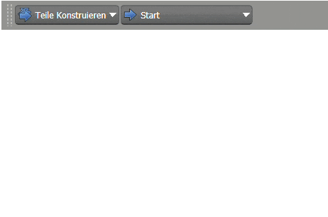
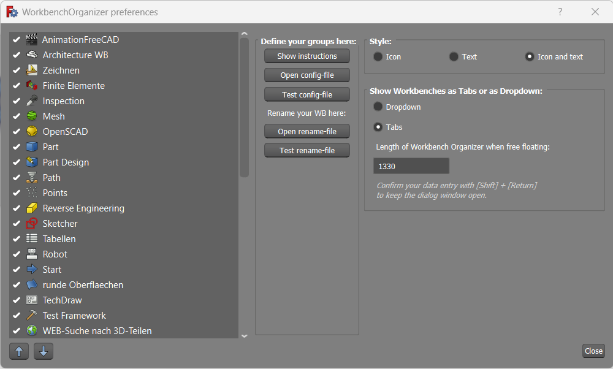
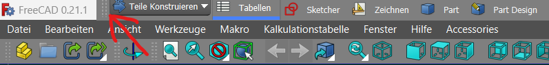
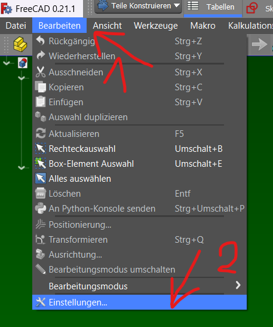
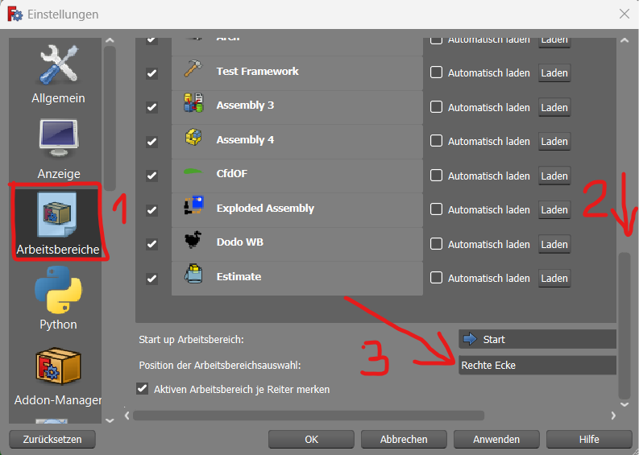

# WorkbenchOrganizer
A workbench organizer widget for FreeCAD.

The aim of the workbench organizer (WBO) is to organize the long list of workbenches into meaningful groups.

The WBO provides **workbench groups** with an **additional selector** to first select a group of workbenches which then allows to select a workbench from a (reduced) group of workbenches with the aim to make it easier to find your workbenches.

It also allows to present the workbenches in tabs or in a dropdown list.

It allows to put **one workbench in multiple groups**. So i.e. the Spreadsheet-Workbench might appear in multiple groups.

It even allows to put workbenches **into the group-selector dropdown**. This might be useful for workbenches like Spreadsheet that you might want to put in many groups maybe to save space in your TabBar.

WBO further allows to **rename workbenches** whether to translate or to give it a - for you - more meaningful name. *Who remembers that a workbench like 'Dodo' is meant for constructing pipelines and frameworks after a year not using FreeCAD? In the videos you can see, that we have renamed several workbenches in German language. Like 'Spreadsheet' --> 'Tabellen'*

Of course, you also find an 'All'-workbenches group to access workbenches the traditional way.

## Preferences dialog
A preferences dialog can be accessed from within the groups-dropdown or under __menu -> Accessories -> WorkbenchOrganizer__.

To be honest, the preferences dialog at the moment is quite rudimentary.
For an introduction to how to create and modify your workbenches, see [instructions.txt](./Resources/Instructions.txt)

_In case our WorkbenchOrganizer finds some fans, we'll continue to improve it. For the moment, this is our MVP (minimal valuable product)._

**I especially like to kudos to TRIPUS who has provided several very exiting tools like the 'Glass' AddOn, the 'PieMenu' AddOn or the 'TabBar' Addon which this WBO is based on.** *The 'TabBar' AddOn has been kind of abandonned since 2017 or so. So I hijacked it and took it as starting point for the development of WBO which saved me a lot of time.*

## Tips how to use the Workbench-Organizer right now
The WBO is a workbench by itself and thus would live inside the workbenches at the top of your window.
The problem with this is, that workbenches are somehow reordered on each change of a workbench. This leads to your WBO jumping around.

We haven't figured out yet how to fix the WBO in the very first line of the workbenches and how to reserve the full first line for it.
So your WBO might all of a sudden collapse to a short widget forcing you to rearrange your workbenches again and again.

That's NOT, what you want.

### BUT ... there's a workaround for the moment.
UNDOCK your WBO from the toolbar and make it free floating! You could attach it to the top, the bottom or even to the sides of your main window. But that's NOT what you go for! 
Move your WBO right at the very top into the header line of FreeCAD, right aside the FreeCAD-LOGO at the top left of your window. So your WBO will sit above your menu.
Like so:

Inside the 'preferences' dialog of the WBO on the right bottom side, you'll find a field to enter the **'Length of Workbench Organizer when free floating'**. This allows you to adopt the lenght of your TabBar to your screen size. 
Confirm your changes with [Shift] + [Return] for not leaving the whole dialog on [Return] and seeing an immediate result! 

As we can't hide the standard workbench selector we want to put it a little bit 'out of our sight' to the top right.
Go to the configuration panel (menu -> edit -> configurations (or so?))

1. Select the Workbench dialog (the 3rd from the top), ...
2. scroll down to the very bottom of the list, and ...
3. select inside the dropdown to place the selector widget to the **top right corner** of the window.

We advice you to also check the 

Now after a restart your old Workbench selector will sit in the top right corner like so:

There it is still available but won't disturb or confuse you.

Finally you might consider to remove some useless buttons from the workbenches area like the file load and save buttons, the undo and redo buttons to save you some more screenspace. *(Won't you use [Ctrl]+[Z] for undo and [Ctrl]+[Y] for redo? So why waste your screen space with these buttons)*

Now you can try to **rearrange all your workbench buttons** in a way that they are not shuffled around on each workbench change. See how the upper left part of our workbenches remain static on the change of workbenches.

We hope WBO helps you to get things done faster and with more pleasure and fun as you do not need to scroll so much on the search for your workbenches.

